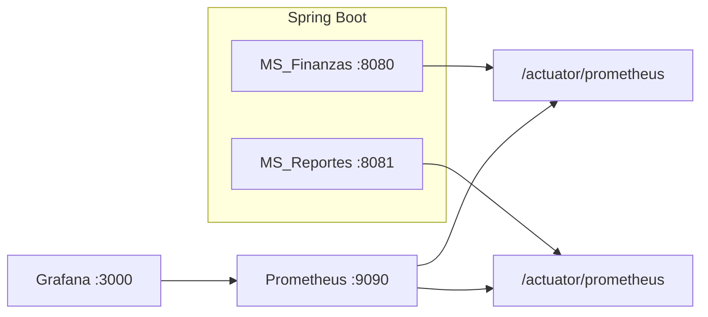

# Revisión de métricas — MS_Finanzas y MS_Reportes

## Arquitectura



- **Micrometer** exporta métricas en formato Prometheus.
- **Prometheus** hace scrape cada 15s (local vía `host.docker.internal`, Render vía HTTPS).
- **Grafana** consulta Prometheus y muestra el dashboard `MS Finanzas y Reportes - Overview`.

## Cómo levantar el stack

### 1. Microservicios

```bash
# Terminal 1
cd MS_Finanzas
SPRING_PROFILES_ACTIVE=local ./mvnw spring-boot:run

# Terminal 2
cd MS_Reportes
SPRING_PROFILES_ACTIVE=local ./mvnw spring-boot:run
```

En Render, activa también `observability` si quieres la etiqueta `environment=render`:

`SPRING_PROFILES_ACTIVE=observability` (además de las variables de BD).

### 2. Prometheus + Grafana

```bash
cd observability
docker compose up -d
```

| Servicio    | URL |
|------------|-----|
| Prometheus | http://localhost:9090/targets |
| Grafana    | http://localhost:3000 (admin / admin) |

### 3. Scrape de Render

Edita [`observability/prometheus/prometheus.yml`](../observability/prometheus/prometheus.yml) y sustituye:

- `REPLACE_FINANZAS_HOST.onrender.com` → hostname real de Finanzas (sin `https://`).
- `REPLACE_REPORTES_HOST.onrender.com` → hostname real de Reportes.

Referencia: [`observability/.env.example`](../observability/.env.example).

Recarga Prometheus: http://localhost:9090/-/reload o `docker compose restart prometheus`.

Comprueba que el endpoint responde en el navegador:

`https://TU-SERVICIO.onrender.com/actuator/prometheus`

## Métricas elegidas

| Métrica | Motivo (SLO / operación) |
|---------|---------------------------|
| `up` | Disponibilidad del target de scrape |
| `http_server_requests_seconds_*` | Latencia y throughput de APIs REST |
| `http_server_requests_seconds_count{status=~"5.."}` | Tasa de errores de servidor |
| `jvm_memory_used_bytes{area="heap"}` | Presión de memoria JVM |
| `hikaricp_connections_*` | Salud del pool hacia PostgreSQL/Supabase |
| `feign_Client_*` (solo ms-reportes) | Dependencia HTTP hacia MS_Finanzas |

Etiqueta común: `application` (`demo` | `ms-reportes`). En Render, `environment=render` si usas el perfil `observability`.

## Verificación rápida

```bash
curl -s http://localhost:8080/actuator/health
curl -s http://localhost:8081/actuator/health
curl -s http://localhost:8080/actuator/prometheus | grep '^application' | head
curl -s http://localhost:8081/actuator/prometheus | grep '^application' | head
```

En Prometheus → **Status → Targets**: jobs `ms-finanzas-local` y `ms-reportes-local` en estado **UP** con las apps locales corriendo.

En Grafana → carpeta **Fabrica** → dashboard **MS Finanzas y Reportes - Overview**.

## Limitaciones

- **Render free tier**: instancias inactivas dejan huecos en las gráficas (`up=0`).
- **`/actuator/prometheus` público** en Render si no se añade autenticación; en producción se restringiría por red o Basic Auth.
- Los jobs `*-render` aparecen **DOWN** hasta configurar hostnames válidos y tener el servicio despierto.

## Archivos del repo

| Ruta | Descripción |
|------|-------------|
| `observability/docker-compose.yml` | Prometheus + Grafana |
| `observability/prometheus/prometheus.yml` | Jobs de scrape |
| `observability/grafana/dashboards/ms-overview.json` | Dashboard unificado |
| `MS_*/src/main/resources/application.yaml` | Exposición `health`, `info`, `prometheus` |
